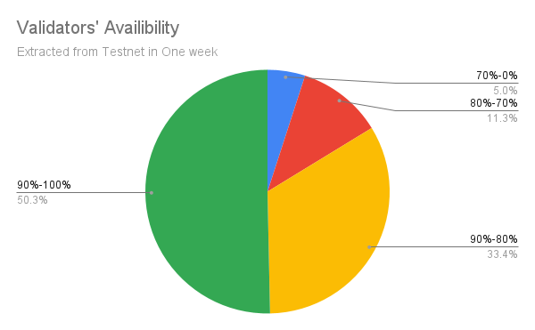

## Abstract

This proposal suggests the introduction of an Availability Score for validators in the Pactus network to enhance network stability.

## Motivation

Some users are running Pactus on extremely low-spec machines, potentially compromising the stability of the blockchain.
For example, at the time of writing this proposal, only 50% of validators have signed more than 90% of blocks in a one-week period.
Considering that validators have a 10-second window to validate the block and broadcast their votes, this percentage is not reasonable.
Therefore, we need to take action to discourage users from dedicating very low-spec machines to run Pactus.

The chart below is extracted from the Testnet data over a one-week period:

This proposal recommends implementing an Availability Score System that evaluates validators based on their performance within the committee.

## Specification

### Availability Score Calculation

Each validator calculates and assigns an "availability score" to other validators.
The availability score is extracted from the last 60,000 block certificates, which is almost one week (with each block having a 10-second interval).
The availability score is calculated by dividing the number of blocks that a validator has been inside the committee by the number of blocks that validators have signed:

$$
S_i = \frac{N_i}{V_i}
$$

Where:

- $S_i$ is the availability score of validator $i$.
- $N_i$ is the number of blocks that validator $i$ has been inside the committee.
- $V_i$ is the number of blocks that validator $i$ has signed the certificate.

### Penalties

When a validator within the committee receives a proposal from another validator, it first checks the availability score of the proposer.
If the availability score is less than $0.9$, the proposal will be rejected, and the validator will enter the proposer-change[^1] phase.
If the majority of validators make the same decision, the proposal will be rejected, and the validator won't receive any reward.

## References

[^1]: [Pactus consensus protocol](https://pactus.org/learn/consensus/protocol/)